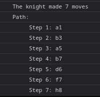

# ♞ Knight Travails

A JavaScript implementation of the **Knight Travails** challenge from [The Odin Project](https://www.theodinproject.com/). This project demonstrates how to use **Breadth-First Search (BFS)** to find the shortest path a chess knight can take from one square to another on an 8x8 chessboard.

## 🌐 Live Demo

[👉 Try it here](https://odin-knight-travails-js.vercel.app/)

> 💡 To interact with the app, open your browser’s developer console.

## 🧠 How It Works

The goal is to determine the shortest path a knight takes from a starting position to an ending position on a standard chessboard using **Breadth-First Search**.

- The knight's movement rules are baked into the algorithm.
- The app returns the shortest possible move sequence.
- It logs the move path directly in the console.

## 🔧 Tech Used

- Vanilla **JavaScript**
- Algorithm: **Breadth-First Search (BFS)**
- Hosted on **Vercel**

## 📸 Example



## 🚀 Usage

1. Open the [live app](https://odin-knight-travails-js.vercel.app/).
2. Open your browser's **console** (Right-click > Inspect > Console tab).
3. Call the main function like so:

```javascript
knightMoves([0, 0], [7, 7]);
// Output: Logs the shortest path in the console
